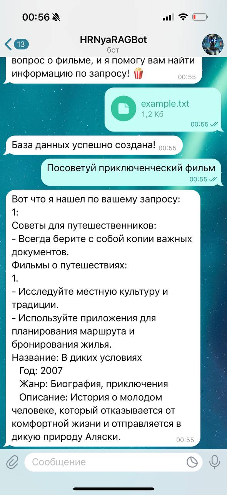

# RAG Chat Bot

Итоговый проект. Написать на основе домашнего задания №2 чат-бот, использующий RAG (retrieval augmented generation) с помощью векторной базы данных (ChromaDB или любой другой) по коллекции пользовательских документов. Бот должен уметь находить релевантные запросу пользователя контексты, опознавать сущности и давать советы по теме документа.

Текущий проект основан на Movie Recommendation Bot, проекте, который представляет собой Telegram-бота для рекомендаций фильмов. Бот использует описание фильмов и сравнивает их с запросами пользователей для предложения похожих фильмов. Бот также поддерживает поиск фильмов по году выхода.

## Архитектура проекта

Схема ниже  описывает взаимодействие между различными компонентами системы и внешними пользователями


## Структура проекта

```
.
├── example.txt             # Пример файла для загрузки в бота
├── docker-compose.yml      # Файл для настройки и запуска контейнеров с помощью Docker Compose
├── Dockerfile              # Файл для создания Docker-образа для проекта
├── scripts
│   └── run.sh             # Скрипт для запуска приложения
└── src
    ├── app.py             # Основной код приложения с логикой бота
    └── requirements.txt   # Список зависимостей Python
```

## Требования

- Python 3.8 или выше
- Docker и Docker Compose

## Установка

### 1. Клонируйте репозиторий

```bash
git clone https://github.com/eznova/movie-bot-rag.git
cd movie-bot-rag
```

### 2. Установите зависимости

Если вы хотите установить зависимости локально, используйте:

```bash
pip install -r src/requirements.txt
python3 -m spacy download en_core_web_sm

```

Однако, для запуска в контейнере Docker, вам не нужно устанавливать зависимости вручную, так как это будет сделано внутри контейнера.

## Настройка

Перед запуском бота, вам нужно настроить несколько переменных окружения:

1. **`BOT_TOKEN`**: Токен вашего Telegram-бота.

Эти переменные можно указать в файле `.env`, который будет автоматически подхвачен системой.

Пример `.env` файла:

```
BOT_TOKEN=your_telegram_bot_token
```

## Запуск с использованием Docker

1. Запустите контейнер с помощью Docker Compose:

```bash
docker-compose up --build
```

Это создаст и запустит необходимые контейнеры для вашего приложения.

## Запуск без Docker

1. Запустите скрипт для загрузки базы данных и запуска бота:

```bash
source .env
cd src
python3 app.py
```

## Описание файлов

- **`docker-compose.yml`**: Конфигурация для запуска проекта в контейнерах Docker. Включает настройку для запуска приложения и управления зависимостями.
- **`Dockerfile`**: Описание процесса сборки Docker-образа, включая установку всех зависимостей.
- **`scripts/run.sh`**: Скрипт для запуска приложения, который используется для автоматизации процесса запуска внутри venv
- **`src/app.py`**: Основной код бота. В этом файле настроена логика для обработки запросов пользователей, поиска похожих фильмов и отправки результатов.
- **`src/requirements.txt`**: Список всех зависимостей Python, которые требуются для работы приложения.

## Логи

Логи работы бота сохраняются в консоль и могут быть полезны для отладки. Логи включают информацию о запуске, успешных операциях, а также о возникающих ошибках.

## Важные замечания

1. Убедитесь, что ваш токен бота (`BOT_TOKEN`) корректен и доступен.
3. При проблемах с Telegram API рекомендуется проверять доступность API и настройки бота.

# Пример использования

[@HRNyaRAGBot](https://t.me/HRNyaRAGBot)


